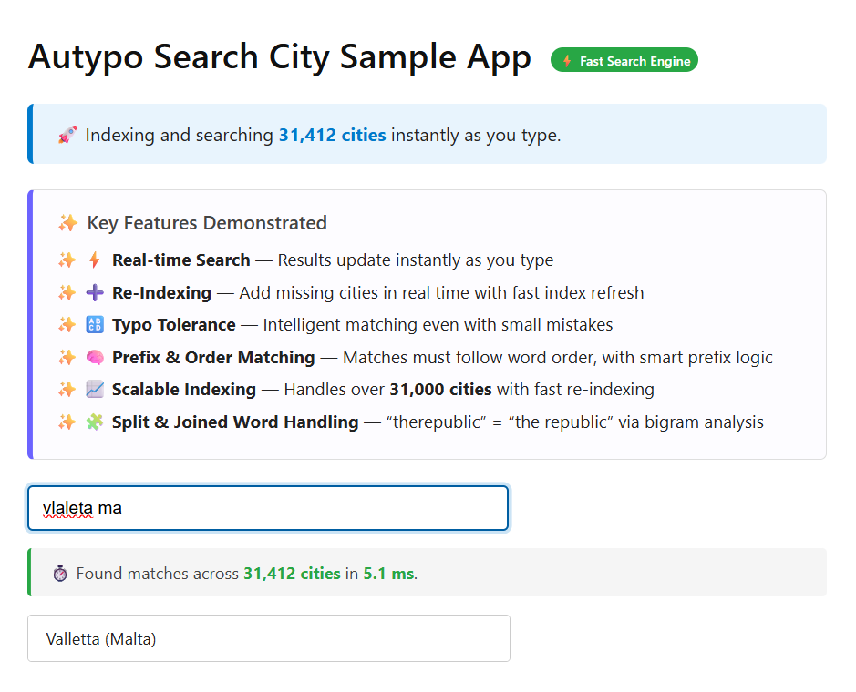
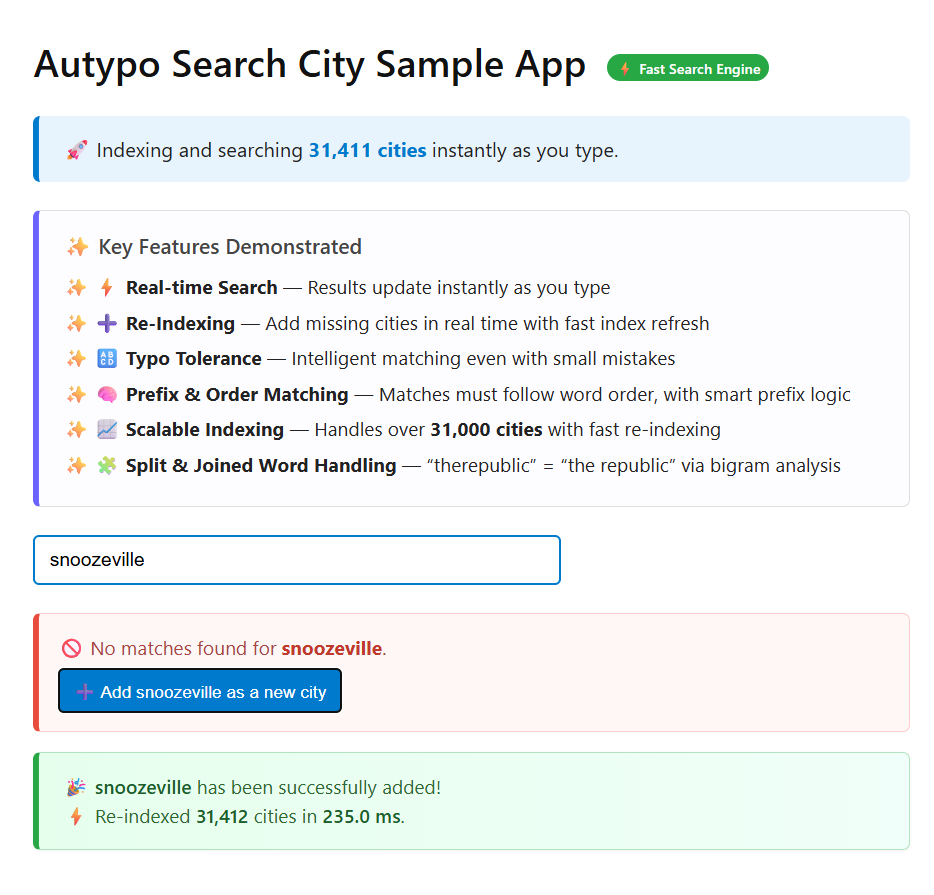

# 🌍 BlazorCities – Real-Time City Search with Autypo

This sample demonstrates how to use the **[Autypo](https://github.com/andrewjsaid/autypo)** library in a **Blazor Server** context for searching a database of cities.

---

## 🎯 What It Does

BlazorCities is a **Blazor Server demo app** that uses the [Autypo](https://github.com/andrewjsaid/autypo) autocomplete engine to power **real-time fuzzy search** over a global dataset of cities.

Users can search from the first keystroke, and even **add new cities** on the fly with instant re-indexing.

---

## 🧠 Key Features Showcased

✅ Fast, in-memory autocomplete using [Autypo](https://github.com/andrewjsaid/autypo)  
✅ Type-ahead search with fuzzy matching  
✅ Partial, out-of-order query support  
✅ Realtime feedback: “Add City” prompt for unmatched entries  
✅ Reindex in milliseconds after adding new items  
✅ Custom indexing using bigrams (`NGramTokenTransformer`) for flexible token overlap

---

## 🖥️ Demo Screenshots

---

### 🔍 Searching for “Valletta”

Autypo doesn’t just find what you type—it understands what you meant to find. Misspellings, partial terms, out-of-order tokens? All good.



---

### 💤 Reindexing is Snoozeville

Sometimes search engines make you wait while they reindex everything just to update a few records. That’s not the Autypo way.

> Autypo supports background and incremental indexing—your users stay productive.



---

## 🧠 Code Highlights

### 🔍 Search Index Setup (in `Program.cs`)
Cities are indexed by their `Name`, with additional keys combining name + country.  
Custom analysis is performed with bigrams to match overlapping sequences like:

- `"newyo"` → `"New York"`
- `"angeles"` → `"Los Angeles"`

```csharp
builder.Services.AddAutypoSearch<City>(config => config
    .WithDataSource(sp => sp.GetRequiredService<CityDatabase>().Cities)
    .WithIndex(city => city.Name, index => index
        .WithAdditionalKeys(city => [$"{city.Name} {city.Country}"])
        .AddNoMinimumLengthQueryFilter()
        .WithTextAnalyzer(analyser => analyser
            .UseAlsoTransformer(() => new NGramTokenTransformer(ngramLength: 2))
        )
    ));
````

---

## 📦 Project Structure

```
/BlazorCities
├── Program.cs                 # Index and search configuration
├── City.cs                    # Simple city model
├── CityDatabase.cs            # Loads cities from CSV
├── world-cities.csv           # Data file with cities + countries
├── Components/
│   ├── Pages/
│   │   └── Home.razor         # Main page
│   ├── AddCityPrompt.razor    # Prompt UI for adding missing cities
│   ├── Routes.razor           # App routing
│   └── App.razor              # Root component
└── README.md                  # You are here
```

---

## 🤔 Why This Matters

Autocomplete is often rigid and frustrating. This demo shows how Autypo enables:

* Flexible, typo-tolerant UX
* Dynamic data handling (user-generated content)
* Highly responsive search without a database

---

## ✏️ Try It Out

* Search for: `"York"`, `"tokyo"`, `"angeles"`, `"mexic"`
* Try a partial query like: `"new yo"`
* Search for something not in the list: `"Atlantis"`
* You’ll see a prompt to add it — click it!
* The index will rebuild, and your custom city becomes searchable.

---

## 📚 Data Attribution

Thanks to [GeoNames.org](https://www.geonames.org/) for providing the open dataset of cities used in this demo.
Their free geographic data is an incredible resource for developers building location-aware applications.